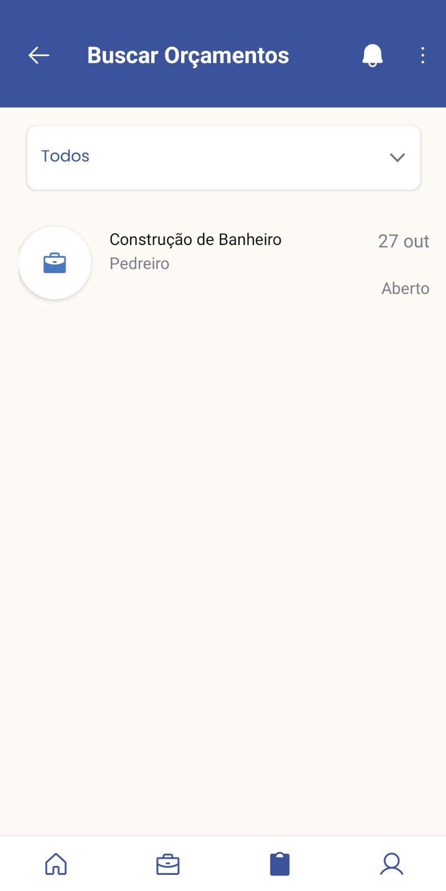

# Contratei - Backend

Este é o backend de um aplicativo para exposição e busca de serviços terceirizados. O projeto foi desenvolvido como Trabalho de Conclusão de Curso (TCC) para o bacharelado em Ciência da Computação, por **Laus Vandresen**, em parceria com **Phelipe Nandi**, responsável pela parte mobile. O sistema oferece funcionalidades de cadastro, busca e gestão de serviços oferecidos por terceiros e utiliza o framework **Spring Boot** integrado com **PostgreSQL** para o gerenciamento de dados.
A parte mobile do projeto pode ser encontrada [aqui](https://github.com/PhelipeNandi/contratei).

## Tecnologias Utilizadas

- **Java 18**
- **Spring Boot 2.7.1**
- **PostgreSQL** para persistência de dados
- **Lombok** para reduzir a verbosidade do código
- **Spring Data JPA** para mapeamento objeto-relacional (ORM)
- **Spring Security** para segurança de endpoints
- **JWT (JSON Web Token)** para autenticação
- **QueryDSL** para consultas dinâmicas e type-safe
  
## Imagens do Aplicativo

